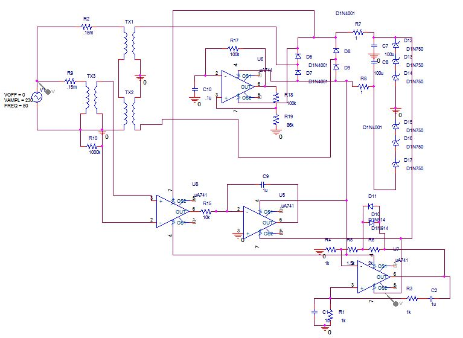
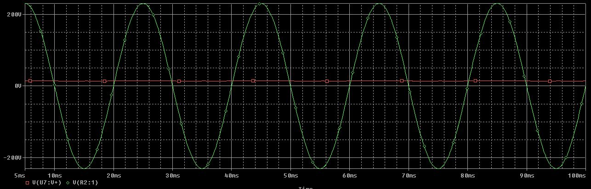

# Rectifier

<!doctype html>

<html>

    <head>

        <meta name="viewport" content="width=device-width, initial-scale=1.0">

        

    </head>

    <body>

        

        

    </body>

</html>
